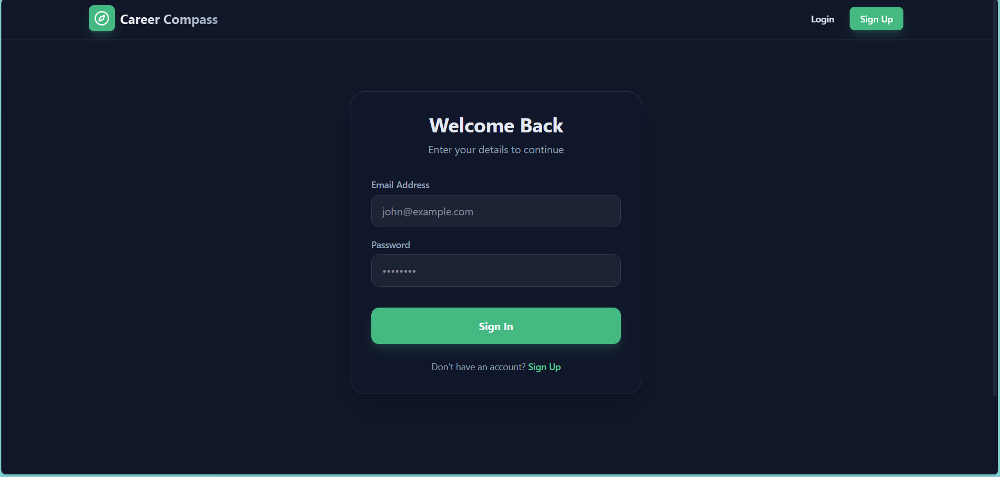
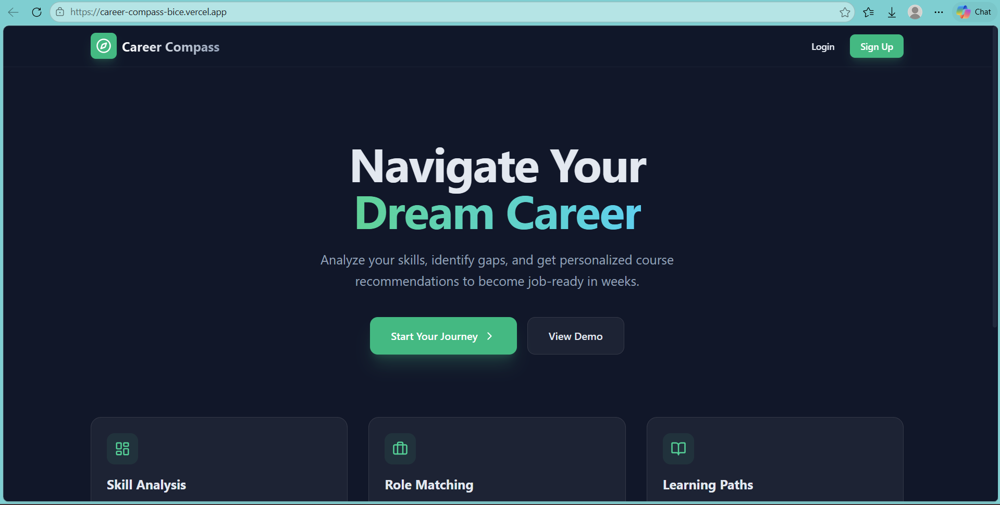
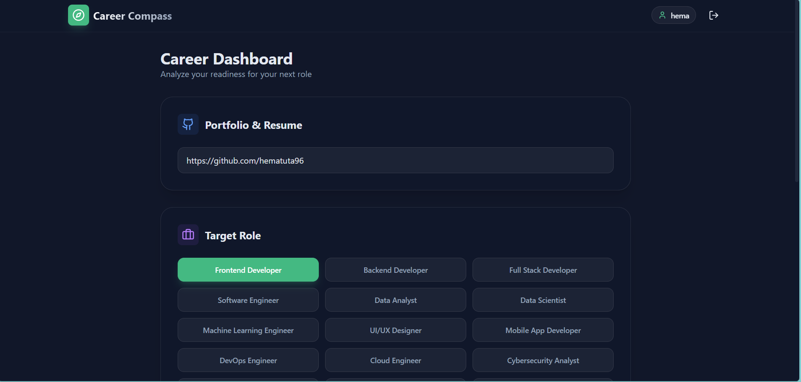
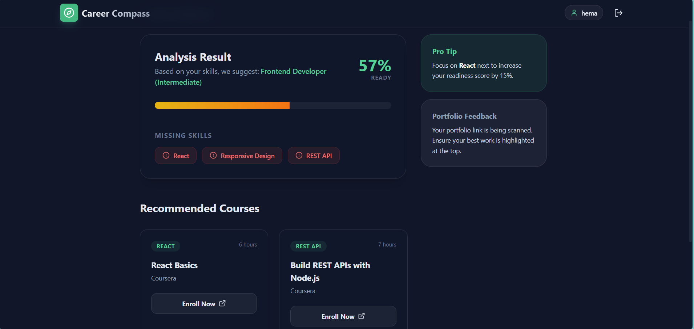

# 🧭 Career Compass
Career Compass is a web application that helps developers and students analyze their **career readiness for different tech roles** based on their skills or GitHub portfolio.
It evaluates the technologies used, calculates a readiness score, identifies missing skills, and recommends courses to improve.
## 🚀 Features
• User signup and login system  
• Select your skills  
• Analyze GitHub repository or portfolio link  
• Calculate **career readiness score**  
• Identify **missing skills** for the selected role  
• Suggest the **best role if user hasn't decided yet**  
• Recommend **courses to learn missing skills**  
• Clean modern UI dashboard
## 🛠 Tech Stack
**Frontend**
- React
- TypeScript
- Tailwind CSS
**Backend / Logic**
- GitHub API
- LocalStorage Authentication
**Tools**
- Vite
- VS Code
- Git & GitHub
## ⚙️ How It Works
1. User signs up or logs in
2. User selects their skills
3. User pastes their GitHub repository or portfolio link
4. The system analyzes technologies used
5. A readiness score is calculated
6. Missing skills are identified
7. Courses are recommended to improve those skills
## 📊 Example Output
- Role Recommendation  
- Readiness Score  
- Missing Skills  
- Recommended Courses
## 📸 Screenshots:
## 📸 Screenshots

### Login Page

### Skill Selection Interface

### Dashboard

### Analysis Result

## 🌐 Live Demo
https://career-compass-bice.vercel.app/

## 💻 GitHub Repository
https://github.com/hematutaa96/career-compass

## 🔮 Future Improvements
• AI based portfolio analysis  
• Resume analysis using NLP  
• GitHub profile skill graph visualization  
• Personalized learning roadmap  
• Database based authentication
## 👩‍💻 Author
**Hema Tuta**
B.Tech Student | Learning Web Development | Building projects
⭐ If you like this project, consider giving it a star!
